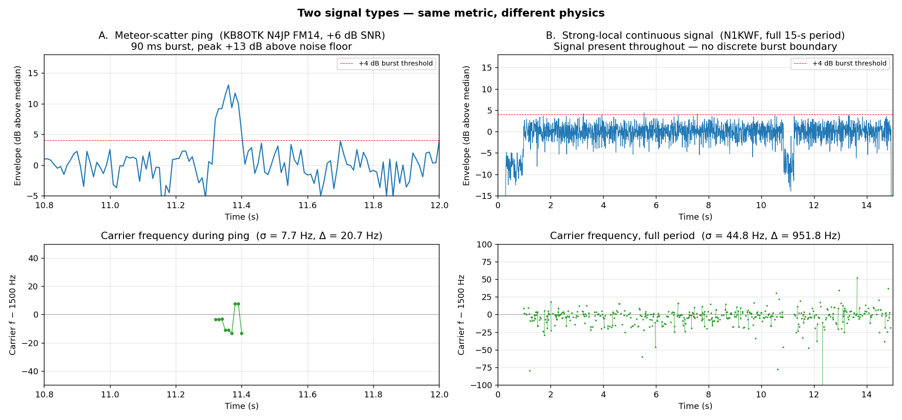
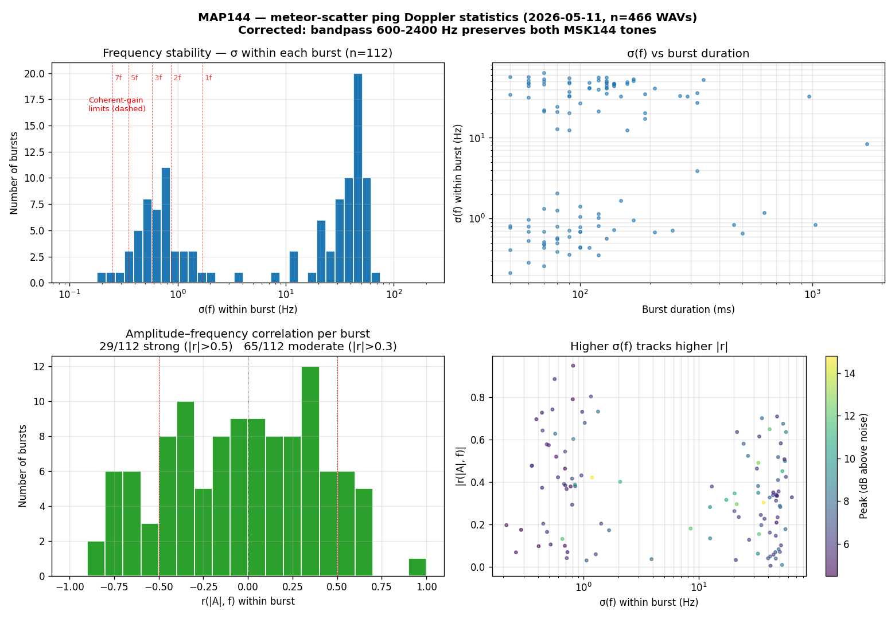

# MAP144 — Technical Briefing

**MSK144 Meteor Scatter Decoder for FlexRadio 6000 / Airspy HF+ / RTL-SDR**

---

## Problem

Meteor scatter propagation on VHF/HF produces sub-second ionization bursts that open brief propagation paths. MSK144 is the WSJT-X digital mode designed for these bursts: two audio tones (1000 Hz and 2000 Hz) carry a 144-bit message in as little as 72 ms. The challenge is that:

- Bursts arrive unpredictably, lasting 72 ms to a few seconds
- The WSJT-X decoder (`jt9`) requires a full 15-second frame to establish a noise baseline — it cannot reliably report SNR from short burst clips
- Watching a waterfall and manually triggering decodes is impractical for unattended operation
- FlexRadio DAXIQ streams require careful VITA-49 timestamp handling to avoid gaps appearing as dark vertical stripes in spectrograms

MAP144 solves this by continuously monitoring the IQ stream, detecting the characteristic paired-tone signature of MSK144 in real time, extracting burst segments, estimating SNR independently, and calling `jt9` automatically.

---

## Architecture

```
IQ Source (48 kHz complex, ±1.0)
        │
        ▼
process_iq_data()           [processing.py]
├── Noise blanker           time-domain impulse rejection
├── Ring buffer             5-second circular IQ store
├── Channelizer             48 channels × 12 kHz (polyphase FIR)
├── Tone-pair detector      squared-domain FFT + 25th-pct baseline
├── Detection threads ──►  extract_and_decode()  [detection.py]
│                               mix · decimate · SNR estimate
│                               WAV write · jt9 · JSONL log
└── Waterfall FFT           48 kHz spectrogram (overlap-add)

MAP144Visualizer            [visualizer.py]
├── Engine (DSP state)      [engine.py]
└── QMainWindow
    ├── 100 ms display timer ──► update_displays()  [displays.py]
    ├── Qt panels + sliders      [ui.py]
    └── Background thread ──►   run_radio_source()  [runtime.py]
```

The class design uses **method mixins**: `MAP144Visualizer` inherits `Engine` and `QMainWindow`, then assigns module-level functions from `processing.py`, `runtime.py`, `displays.py`, and `ui.py` as class attributes. This keeps each concern in its own file without deep inheritance chains.

---

## Key Components

### IQ Sources

| Source               | File               | Library            | Default Freq | Notes                                       |
| -------------------- | ------------------ | ------------------ | ------------ | ------------------------------------------- |
| FlexRadio 6000 DAXIQ | `flexclient/`      | TCP/UDP custom     | 50.260 MHz   | VITA-49 timestamps; ±32768 ADC scale        |
| Airspy HF+           | `airspy_source.py` | libairspyhf ctypes | 28.180 MHz   | 192–912 kHz hw rate; FIR decimate to 48 kHz |
| NooElec NESDR Smart  | `rtlsdr_source.py` | librtlsdr ctypes   | 50.260 MHz   | 960 kHz → 48 kHz (20×); uint8 → ±1.0        |
| WAV file             | `runtime.py`       | scipy              | —            | Hilbert transform for mono → complex        |

All sources emit packets with `(samples: complex64, timestamp_int, timestamp_frac)`. WAV, Airspy, and RTL-SDR use picosecond-encoded wall-clock timestamps (`t = ts_int + ts_frac × 1e-12`). FlexRadio uses VITA-49 TSF (sample-count within second).

SoapySDR is **not used** — the apt `python3-soapysdr` (v0.8.1) has an ABI mismatch with the locally-built SoapyAirspyHF module (v0.8.3). Both SDR sources use direct ctypes bindings instead.

### Engine (`engine.py`)

Pure-NumPy DSP state class. Allocates all persistent buffers at init:

| Buffer                | Shape                 | Purpose                         |
| --------------------- | --------------------- | ------------------------------- |
| `_iq_ring`            | `(240000,)` complex64 | 5-second circular IQ store      |
| `_ch_buf`             | `(48, 512)` complex64 | Channelizer accumulator         |
| `_ch_snr_history`     | `(705, 48)` float32   | Heatmap rolling history         |
| `_metric_hist_buf`    | `(300, 48)` float32   | Percentile baseline history     |
| `_sbuf`               | `(12288,)` complex64  | Overlap-add waterfall buffer    |
| `spectrogram_staging` | `(705, 2048)` float32 | Current 15-sec FFT accumulation |
| `spectrogram_data`    | `(705, 2048)` float32 | Completed 15-sec snapshot       |

### Channelizer (`radio_iq_gui/channelizer.py`)

Polyphase-style filterbank splitting 48 kHz IQ into 48 × 1 kHz channels, each decimated 4× to 12 kHz: per-channel NCO mix, scipy low-pass FIR, decimation, then a per-channel high-pass at 12 kHz.

Channel mix frequencies on the 48 kHz IF are 0 Hz, 1 kHz, …, 47 kHz in an unfolded view (indices ≥ 25 alias from the negative side). A 300 Hz per-channel high-pass at 12 kHz removes DC and LO leakage within each downconverted channel.

### Tone-Pair Detector (`processing.py`)

MSK144 uses tones at `fc ± 500 Hz`. Complex squaring maps these to `2fc ± 1000 Hz`, concentrating the signal energy into a searchable pair. Per 512-sample block at 12 kHz (42.7 ms):

```
1. Square each channel block: s² (maps fc±500 Hz → 2fc±1000 Hz)
2. Hanning-windowed 512-point FFT
3. Extract peak power in ±200 Hz windows around ±1000 Hz
4. raw_metric = (lo_peak + hi_peak) / 2
5. Normalize: metric_dB = 10·log10(raw / 25th-percentile baseline)
6. Trigger if metric_dB > 3.5 dB and not in 1-second cooldown
7. Recover fc: fc_hz = (freq_lo + freq_hi) / 4
```

The **25th-percentile rolling baseline** (300-sample history ≈ 6.4 sec) mirrors the WSJT-X `xmed` algorithm in `msk144spd.f90`. It normalizes out slow power variations (propagation, AGC) while remaining sensitive to genuine bursts.

Edge channels (within ±4 of Nyquist) and DC channels (within ±3 of DC) are skipped to avoid filter rolloff and LO leakage false triggers.

### Extract & Decode (`detection.py`)

Spawned as daemon threads on each detection trigger (semaphore caps at 4 concurrent `jt9` processes):

```
1. Wait up to 2 seconds for 1200 ms of post-detection IQ to arrive in ring
2. Read [−500 ms, +1200 ms] window from ring buffer
3. Zero-pad 100 ms each end
4. Mix: shift fc_hz → 1500 Hz (jt9 expected audio center)
5. Decimate 48→12 kHz (4×, scipy.signal.decimate)
6. Estimate SNR (pre-burst noise floor vs. peak burst power)
7. Normalize to 90% full scale
8. Write 16-bit mono WAV at 12 kHz
9. jt9 --msk144 -p 15 -L 900 -H 2100 -f 1500 -F 600 -d 3
10. Parse jt9 output; log to JSONL; save WAV; push to decode_queue
```

### SNR Estimator (`detection.py: _estimate_snr_db`)

`jt9` cannot produce a valid SNR from a short burst WAV (it needs a full 15-second frame for its noise baseline). MAP144 estimates SNR using the 500 ms pre-detection segment as a noise-only reference:

```
Noise:  Overlap-averaged PSD over pre-burst segment
        noise_per_bin = median of out-of-band bins (200–5500 Hz, excl. signal)

Signal: Sliding 1024-sample Hanning FFT through burst region
        best = max in-band power (900–2100 Hz)

SNR_dB = 10·log10(signal / (noise_per_bin × ref_bins))
         ref_bins = 2500 Hz / bin_width   ← WSJTX 2500 Hz BW convention
```

### Displays (`displays.py`)

100 ms Qt timer drives all rendering. Reads shared NumPy buffers without locks (single writer, single reader at different rates). Key updates:

- **Spectrogram**: `pyqtgraph.ImageItem.setImage()` with time/freq `QRectF` derived from VITA-49 timestamps
- **Heatmap**: `fftshift` of `_ch_snr_history` → 48-channel detection metric image; overlaid scatter plot circles (red = pending, green = decoded)
- **Decode panel**: UTC time, RF frequency, SNR, jt9 message string
- **Status bar**: packet rate, loss %, noise blanker activity %, power range

---

## Algorithms

### Overlap-Add Waterfall

The 48 kHz IQ stream is converted to a spectrogram via 50% overlapping Hanning-windowed FFTs written into a 15-second accumulation buffer. The write row is computed from the VITA-49 timestamp rather than a sequential counter:

```python
row = int((pkt_time - window_start) * blocks_per_sec)
```

This keeps the spectrogram time-accurate even when packets are delayed by CPU load. Dropped packets produce blank rows rather than compressing time (the previous `write_index++` approach hid gaps by writing consecutive rows).

### Noise Blanker

Time-domain impulse rejection using a soft-blanking mask to avoid sinc sidelobes from rectangular blanking windows:

```
1. Running RMS envelope (2-second EMA, updated only from unblanked samples)
2. Threshold = nb_factor × envelope  (default 6.0×, adjustable 1–10×)
3. Hann-tapered mask convolution (24-sample half-width, ≈0.5 ms)
4. Zero impulses above threshold; leave sub-threshold samples unchanged
```

Using only unblanked samples for envelope updates prevents large impulses from raising the threshold enough to hide themselves.

### Batch Queue Drain

The FlexRadio VITA-49 stream delivers ~375 packets/second. A previous design processed one packet per outer-loop iteration; a 1-second CPU-load stall would produce 375 queued packets needing 375 loop iterations to drain. The current design drains up to 64 packets per iteration, with a blocking `get(timeout=1.0)` only when the queue is empty.

---

## Propagation Physics: Meteor-Scatter Doppler and Coherence

MSK144 coherent integration is limited by the frequency stability of the signal over the integration window.



*Left: meteor-scatter ping (KB8OTK), 90 ms burst with carrier σ = 7.7 Hz within the burst.  Right: strong-local continuous signal (N1KWF), full 15-s period with carrier wandering σ = 44.8 Hz across the period.  Same metric (instantaneous carrier from squared-spectrum sliding FFT), very different signal physics.*

For 6 m (50 MHz, λ ≈ 6 m) the path applies Doppler from three sources:

| Source | Magnitude | Time scale |
|---|---|---|
| **Trail wind drift** — 100-200 m/s wind at 90-100 km altitude | ±30-65 Hz radial | Quasi-constant over a ping; varies slowly across a session |
| **Trail expansion** — ambipolar diffusion of the ionized column, 1-5 m/s | ±0.3-1.7 Hz | Monotonic decay toward zero as the trail expands |
| **Multipath between reflection points** | A few to tens of Hz | Fast — the time-domain signature is *amplitude flutter* |

The third source is the most relevant to decoder design.  Multiple ionized regions along the trail reflect simultaneously, each at a slightly different radial velocity and therefore slightly different Doppler.  The decoded signal is the coherent sum of these reflections.  **Amplitude flutter and frequency flutter are the same phenomenon** — both are interference between multiple-Doppler paths producing time-varying constructive/destructive combinations.

### Implication for coherent integration

For coherent averaging to gain SNR linearly with the number of averaged frames `N`, the signal phase must stay within roughly π/4 over the full integration window.  The bound this places on frequency stability:

| Coherent window | Max Δf within window |
|---|---|
| 1 frame (72 ms) | ±1.7 Hz |
| 2 frames (144 ms) | ±0.87 Hz |
| 3 frames (216 ms) | ±0.58 Hz |
| 5 frames (360 ms) | ±0.35 Hz |
| 7 frames (504 ms) | ±0.25 Hz |

WSJT-X's MSK144 decoder (Deep mode, `-d 3`) attempts 5- and 7-frame coherent averages.  Those work on smooth overdense trails dominated by a single reflection and **fail silently on fluttery signals** — the algorithm has no in-burst frequency tracking, so when the signal drifts the coherent gain degrades but is still attempted and counted.  This is one source of phantom decodes during noise/multipath events.

### Where MAP144 could differ from WSJT-X

Existing WSJT-X coherent integration assumes the signal is stationary in frequency over the averaging window.  A measurement-driven extension for MAP144:

1. Split the burst into sub-windows (e.g., 5 × ~72 ms slices) and estimate fest in each.
2. Compute the frequency-vs-time track for the burst.
3. Either **mix-correct** the signal against the tracked frequency *before* coherent averaging, recovering coherent gain on fluttery signals, or **gate** the coherent-averaging length based on the measured drift variance vs the coherence bound above.

This is a genuine algorithmic step beyond WSJT-X — not a port but a measurement-validated extension.  Open questions answerable from a per-burst dataset of WAV files + per-burst frequency-vs-time measurements:

- How much does frequency change within a typical burst?
- Does amplitude flutter correlate with frequency flutter (and how strongly)?
- What is the practical upper bound on coherent-integration length for 6 m MS?
- For what fraction of pings would mix-correction during integration meaningfully improve decode SNR?

These distributions do not appear to be published in measured form anywhere in the literature; building this dataset locally is a meaningful contribution.

### Initial measurements (2026-05-11 corpus, 145 bursts)



*Top-left: σ(f) within burst, log-x.  Vertical red dashed lines mark the worst-case coherent-gain ceiling for N = 1, 2, 3, 5, 7 frames of coherent averaging — most bursts exceed even the 1-frame ceiling.  Top-right: σ(f) vs burst duration — drift accumulates over time.  Bottom-left: amplitude–frequency correlation distribution — 26% of bursts show |r| > 0.5, half show |r| > 0.3, confirming the multipath-flutter mechanism.  Bottom-right: |r| vs σ(f), peak-SNR coloured — bursts with larger σ(f) tend to have stronger amplitude–frequency correlation.*

Headline numbers from 145 bursts after outlier filter:

- σ(f) within burst: median 7.5 Hz, p75 13.1 Hz (grows with burst duration: 6.6 Hz for <100 ms, 13.5 Hz for 200-400 ms).
- Fraction satisfying the worst-case coherent-gain criterion at each N: N=1 4.8%, N=2 1.4%, N≥3 0%.
- Amplitude–frequency correlation: 26% of bursts strong (|r|>0.5), 50% at least moderate (|r|>0.3).

The strict-coherence ceiling is conservative — it assumes uniform random frequency walk, but real drift is mostly linear, which SPD's matched filter tolerates better.  However, the result is consistent with the empirical observation that WSJT-X's `-d 3` Deep mode (which adds 5- and 7-frame averages) produces phantom decodes during noise events more than it produces real catches on long sustained signals — the underlying physics doesn't supply enough coherent signal for the longer averages to converge.

---

## Current Limitations

**RTL-SDR gain calibration**: The 20 dB fixed manual gain is a starting point. The R820T2 accepts only discrete gain steps; the nearest step is applied silently. No UI control for gain adjustment — requires editing `runtime.py`.

**RTL-SDR kernel driver**: `dvb_usb_rtl28xxu` must be blacklisted manually before the device is accessible via librtlsdr. Not automated.

**jt9 SNR accuracy**: The pre-burst SNR estimate works well for isolated bursts but degrades when the 500 ms pre-detection window contains a previous burst tail or strong interferer. jt9's own SNR (from a full 15-second frame) is preferred when available but rarely is for short bursts.

**Channelizer CPU load**: The mix/LP/decimate path is NumPy/scipy vectorized but still heavier than a native polyphase implementation; on slower machines the VITA-49 queue can build up faster than it drains under sustained load.

**No frequency tuning UI**: Center frequency is fixed at construction. Changing frequency requires restarting the source. The FlexRadio source follows the radio's tuned frequency automatically via VITA-49 metadata, but the SDR sources (Airspy, RTL-SDR) do not update dynamically.

**Airspy HF+ coverage gap**: The Airspy HF+ does not cover 50 MHz (6m). Its VHF coverage starts at 60 MHz. The default 28.180 MHz (10m MSK144) is within range; 50.260 MHz (6m) requires the FlexRadio or RTL-SDR.

**WAV file playback speed**: Mono WAV files are converted to complex via Hilbert transform. The resampling uses linear interpolation rather than a proper polyphase filter, which is adequate for display but introduces mild aliasing in the channelizer output.

**No persistence across sessions for decode log**: The in-memory decode panel is cleared on source switch and not restored on application restart. The JSONL log files in `MSK144/detections/` persist.

**Single DAXIQ channel**: FlexRadio support is hardcoded to DAX channel 1. Multi-channel monitoring would require multiple `FlexDAXIQ` instances.
